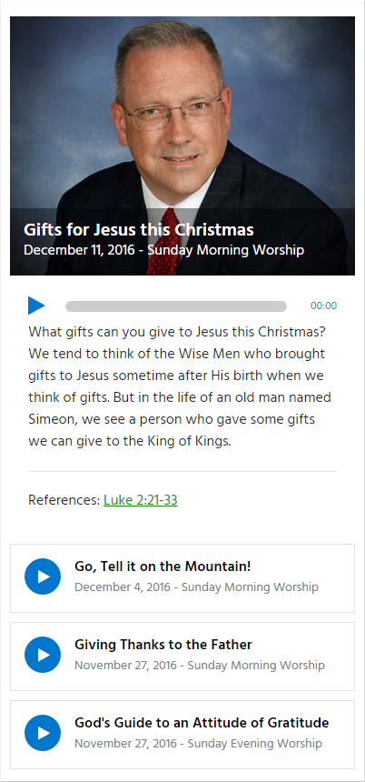

# Sermon Player WordPress Plugin

## 1. Description
A WordPress plugin for displaying and playing sermon audio files.

## 2. Screenshots

## 3. OnePlace.com
The sermon player look and feel was originally based on the audio player found at [oneplace.com](http://www.oneplace.com/ministries/love-worth-finding/).

## 4. jPlayer
The plugin makes use of the JQuery HTML5 audio/video library known as [jPlayer](http://jplayer.org/). The jPlayer library version ??? is included with the sermon player plugin as a minified JavaScript file.

## 5. Bible References
The bible references link to [Bible Study Tools](http://www.biblestudytools.com). It specifically links to the NKJV of the bible.

## 6. Social Media
## 6.1 Facebook Sharing

